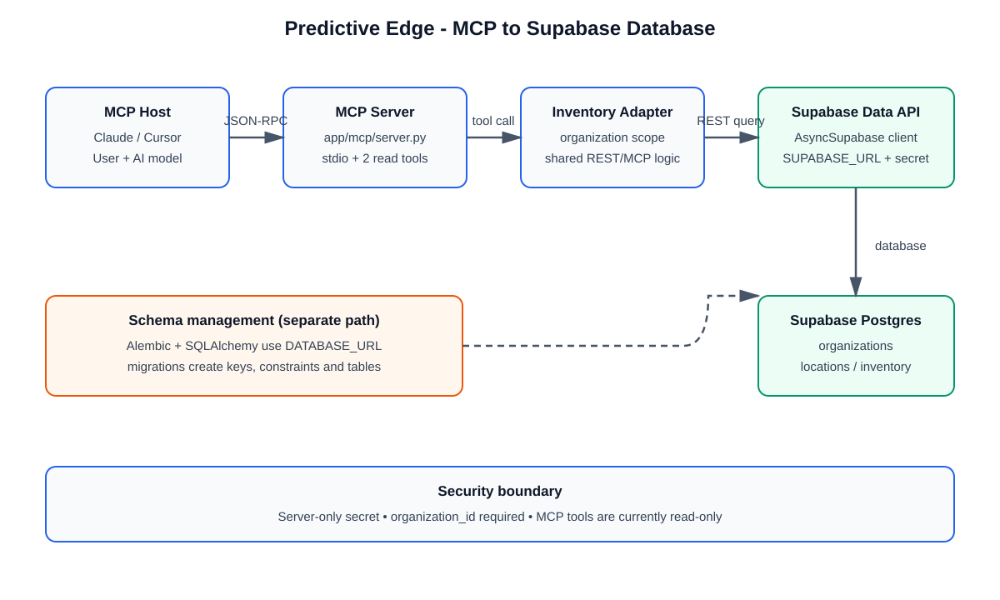

# Predictive Edge mein MCP Guide

## 1. MCP kya karta hai?

**MCP (Model Context Protocol)** AI client ko controlled tools ke zariye application
data ya actions use karne deta hai. Is project mein MCP ek alag **stdio server**
hai; yeh FastAPI route nahi hai. Claude Desktop, Cursor ya koi compatible MCP host
is process ko launch karke JSON-RPC messages stdin/stdout par bhejta hai.

Is waqt server sirf inventory read karta hai:

| MCP tool | Input | Output | Side effect |
| --- | --- | --- | --- |
| `get_inventory` | `organization_id`, optional `location_id` | inventory items ki list | None (read-only) |
| `get_inventory_item` | `organization_id`, `inventory_id` | ek inventory item | None (read-only) |

## 2. Project mein end-to-end flow

1. MCP Host (AI app) `python -m app.mcp.server` ko child process ke roop mein
   start karta hai.
2. MCP Client/SDK tool list discover karta hai.
3. Model user ke sawaal ke hisaab se `get_inventory` ya
   `get_inventory_item` call karta hai.
4. `apps/backend/app/mcp/server.py` UUID input parse karta hai aur standalone
   process ke liye `AsyncSupabase.init()` ensure karta hai.
5. MCP server shared `inventory_adapter` ko call karta hai.
6. `SupabaseInventoryAdapter` organization filter ke saath Supabase ke
   `inventory` table ko query karta hai.
7. Supabase Postgres se result lautata hai; MCP response host ko milta hai.

MCP aur REST dono same adapter use karte hain. Iska matlab inventory ki query
logic do jagah duplicate nahi hoti. REST mein RBAC dependency lagi hui hai;
standalone MCP process trusted host ke andar chalna chahiye aur caller ko sirf
authorized organization IDs dene chahiye.

## 3. Database connection kaise hai?

### Runtime reads

- `.env.local` (ya `.env`) se `SUPABASE_URL` aur `SUPABASE_SECRET_KEY` load hote hain.
- `AsyncSupabase.init()` ek async Supabase client banata hai.
- Adapter `async_supabase.table("inventory")...execute()` ke zariye Supabase
  Data API ko call karta hai.
- Supabase Data API ke peeche project ka PostgreSQL database hai.

### Schema/migrations

- `DATABASE_URL` SQLAlchemy/Alembic ke liye use hota hai.
- `alembic upgrade head` migrations ko PostgreSQL database par apply karta hai.
- `inventory.organization_id -> organizations.id` aur
  `inventory.location_id -> locations.id` foreign keys hain.
- `(organization_id, location_id, sku)` unique constraint duplicate stock rows
  ko rokta hai.

Is repository mein runtime inventory reads Supabase client se hain, jabki
Alembic/SQLAlchemy schema management ke liye hai. Dono ko same Supabase
PostgreSQL project/database ke credentials se point karna zaroori hai.



## 4. Local setup

PowerShell mein:

```powershell
cd C:\Abhay\MyPredictive_Edge\apps\backend
pip install -r requirements.txt
```

Backend environment mein kam se kam yeh values honi chahiye:

```dotenv
SUPABASE_URL=https://<project-ref>.supabase.co
SUPABASE_SECRET_KEY=<server-only-secret-key>
DATABASE_URL=<postgres-connection-string>
```

Database schema apply karein:

```powershell
cd C:\Abhay\MyPredictive_Edge\apps\backend
alembic upgrade head
```

MCP server run karein:

```powershell
cd C:\Abhay\MyPredictive_Edge\apps\backend
python -m app.mcp.server
```

Yeh command terminal mein normal human-readable output nahi dikhayegi; stdio
protocol ke kaaran isse MCP host se launch karna hota hai.

## 5. MCP host configuration ka pattern

MCP host ke config mein command aur working directory set karein. Example
conceptual configuration:

```json
{
  "mcpServers": {
    "predictive-edge-inventory": {
      "command": "python",
      "args": ["-m", "app.mcp.server"],
      "cwd": "C:\\Abhay\\MyPredictive_Edge\\apps\\backend"
    }
  }
}
```

Apne host ke format ke mutabik key names badal sakte hain. Secret key ko config
file mein hard-code na karein; environment/secret manager se inject karein.

## 6. Role model (responsibility matrix)

| Role | Responsibility | Is project ka component |
| --- | --- | --- |
| MCP Host | User conversation aur model orchestration | Claude/Cursor/compatible AI app |
| MCP Client | Server start, handshake, tool calls | Host ke andar MCP SDK |
| MCP Server | Safe tool surface expose karna | `app/mcp/server.py` |
| Tool | Typed, narrow capability dena | `get_inventory`, `get_inventory_item` |
| Adapter | Business query aur organization scoping | `inventory_adapter` |
| Data gateway | Async authentication/API connection | `AsyncSupabase` |
| Database | Durable relational data | Supabase PostgreSQL |
| Schema manager | Tables, keys, constraints migrate karna | Alembic + SQLAlchemy |
| Security owner | Secret handling aur authorization boundary | Deployment/configuration owner |

## 7. Security aur future extension

- MCP ko trusted local/server environment mein run karein.
- `SUPABASE_SECRET_KEY` ko browser, git ya client-side config mein expose na karein.
- Har tool mein organization scope mandatory rakhein.
- Naye write tools add karne se pehle RBAC, audit logging, validation aur
  confirmation flow define karein.
- Abhi MCP read-only hai; `upsert`/`update` MCP tools intentionally expose nahi
  kiye gaye hain.

## 8. Quick troubleshooting

| Problem | Check |
| --- | --- |
| `Missing Supabase configuration` | `.env.local`/`.env` aur variable names check karein |
| `AsyncSupabase not initialized` | Server ko `python -m app.mcp.server` se launch karein; latest code standalone init karta hai |
| Empty list | `organization_id`, optional `location_id`, aur database rows verify karein |
| Migration error | `DATABASE_URL` valid PostgreSQL URL hai aur `alembic upgrade head` backend folder se chal raha hai |
| Tool host connect nahi karta | `cwd`, Python environment, command path aur stdio logs check karein |

## Source of truth

- MCP tools: `apps/backend/app/mcp/server.py`
- Shared inventory logic: `apps/backend/app/modules/inventory/adapter.py`
- Supabase client: `apps/backend/app/services/supabase_client.py`
- Settings: `apps/backend/app/core/config.py`
- Schema migrations: `apps/backend/alembic/versions/`
